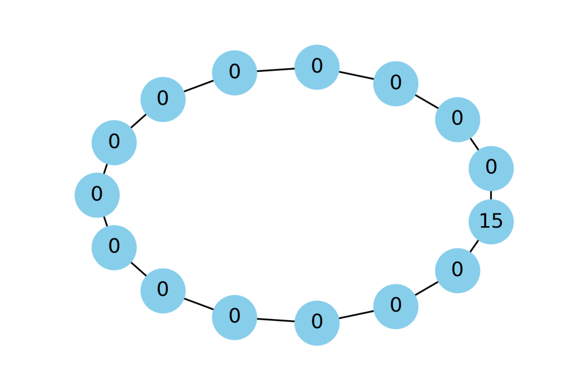
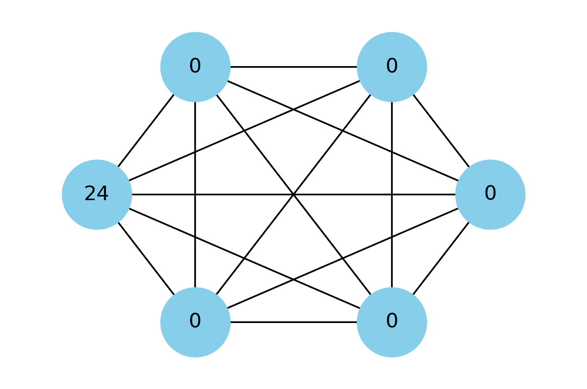
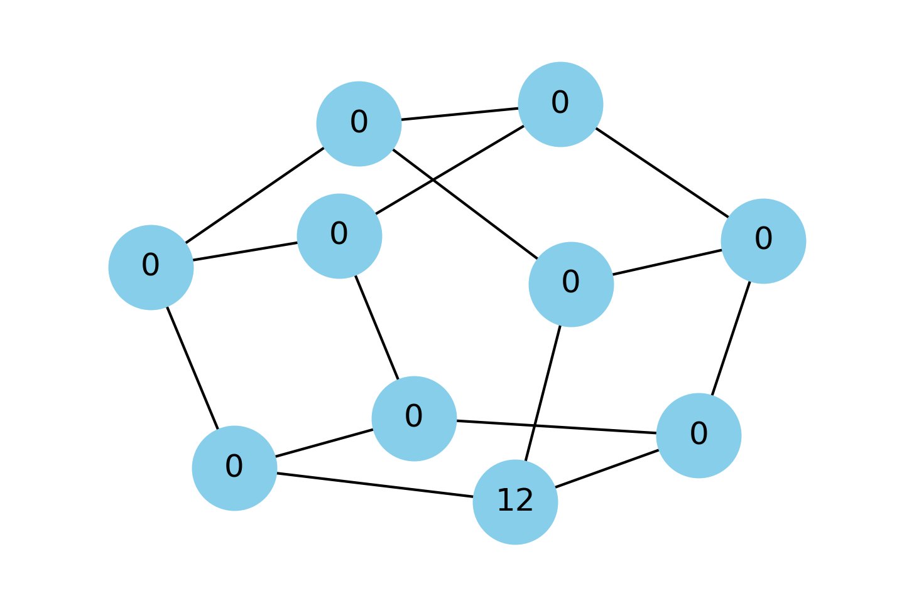

# Kafinc Project

## Background
This program that I made during my REU simulates the chip-firing game. Instead of keeping track of 25 nodes and firing them by hand, we decided to make a computer do it for us so that we could focus on analyzing the patterns we were researching.
I was introduced to the Python module NetworkX which can draw graphs given an adjacency matrix.

## Code
Given an adjacency matrix, virtually any graph can be drawn. Besides that, there are a few categories of graphs that this program can draw without the adjacency matrix given their parameters:
- cycles;
- three-regular "ladder" graphs;
- complete graphs.

There also are options to not just test one graph but also multiple within the chip-firing "unknown stability interval", the chip number interval over which the stability of the graph 
is not governed by the well-established stability theorems. The interval was the focus of our research.

## Output
Fifteen-cycle playing out with fifteen chips

Complete graph on six nodes with twenty-four chips

Three-regular graph on ten nodes with twelve chips

